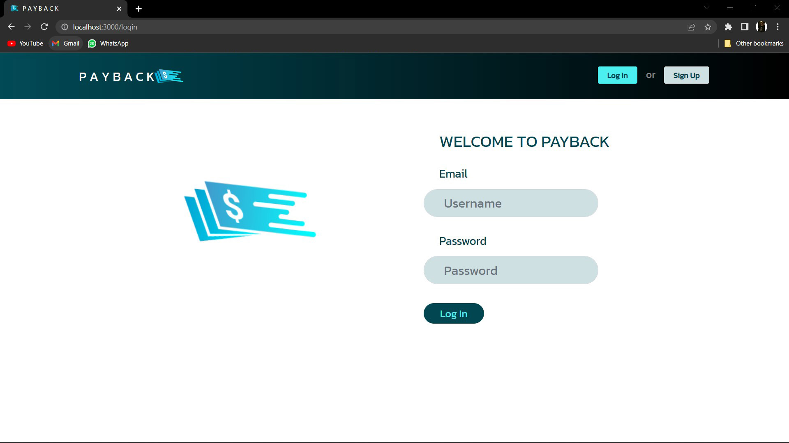

**TOPIC: Payback**

**Team Members:**
1. Siddhant Nagraj - 002794527
2. Jash Pandav     - 002728124
3. Mayur Chaudhari - 002736792
4. Swanand Tanavade - 002774342

**About Project:**
PAYBACK is basically an expense tracker and expense splitter app developed using HTML,CSS,Javascript,Node,express and Mongodb.
There will be multiple logins for multiple members. A dashboard will consist of a feature that will allow users to add/update/view/delete an expense etc. 

**User Requirements:**
As a user I should be able to create an account / login to an exisiting account / logout etc. I should be able to create a group and others can join through their unique usernames. 
User should be able enter details like Name / Email / USER ID / Expense. 
User should be able to add multiple expenses in addition to already added expenses.
Users should be able to add expesnse in their list / edit the expense in their  list / delete the expense etc.
Users will be able to add a shared expense in the group tab and that expense will be split between the members of the group as per the condition set by the person adding the expense.


**Screenshots:**

<p align="center">
   
</p>


<p align="center">
   
</p>


<p align="center">
   
</p>

<p align="center">
   
</p>

<p align="center">
   
</p>

<p align="center">
   
</p>

<p align="center">
   
</p>

<p align="center">
   
</p>


<p align="center">
   
</p>


<p align="center">
   
</p>

<p align="center">
   
</p>


**How to run and use?**

Use npm install to install all the dependencies. (In Terminal)
1. cd/BACKEND
   npm install

2. cd/FRONTEND 
   npm install

Use node command to start BACKEND side server

3. cd/BACKEND
   node app.js

Use npm start to start the FRONTEND side sever . (In another Terminal)

4. cd/FRONTEND
   npm start
```
And point your browser to `http://localhost:3000`.

